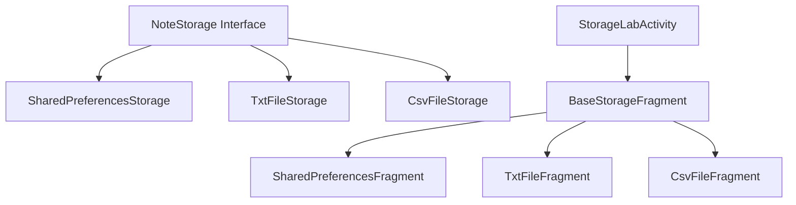

# Реализация хранилищ данных для Android

## Обзор проекта

Успешно реализованы **три типа хранилищ данных** с полным набором **CRUD операций**:

1. 🔧 **SharedPreferences** - легковесное хранилище для пар ключ-значение
2. 📄 **TXT файл** - текстовый файл в app-specific storage  
3. 📊 **CSV файл** - CSV файл в shared storage (Downloads)

---

## Архитектура решения

### Иерархия классов



### Компоненты

**Model Layer**
- [Note.kt](file:///c:/Users/ILYOUSHA/AndroidStudioProjects/MOBDEV_LAB6/app/src/main/java/com/example/mobdev_lab3/model/Note.kt) - модель заметки с методами сериализации

**Repository Layer**
- [NoteStorage.kt](file:///c:/Users/ILYOUSHA/AndroidStudioProjects/MOBDEV_LAB6/app/src/main/java/com/example/mobdev_lab3/repository/NoteStorage.kt) - интерфейс для CRUD операций
- [SharedPreferencesStorage.kt](file:///c:/Users/ILYOUSHA/AndroidStudioProjects/MOBDEV_LAB6/app/src/main/java/com/example/mobdev_lab3/repository/SharedPreferencesStorage.kt) - реализация для SharedPreferences
- [TxtFileStorage.kt](file:///c:/Users/ILYOUSHA/AndroidStudioProjects/MOBDEV_LAB6/app/src/main/java/com/example/mobdev_lab3/repository/TxtFileStorage.kt) - реализация для TXT файлов
- [CsvFileStorage.kt](file:///c:/Users/ILYOUSHA/AndroidStudioProjects/MOBDEV_LAB6/app/src/main/java/com/example/mobdev_lab3/repository/CsvFileStorage.kt) - реализация для CSV файлов

**UI Layer**
- [StorageLabActivity.kt](file:///c:/Users/ILYOUSHA/AndroidStudioProjects/MOBDEV_LAB6/app/src/main/java/com/example/mobdev_lab3/StorageLabActivity.kt) - главная Activity с ViewPager2
- [BaseStorageFragment.kt](file:///c:/Users/ILYOUSHA/AndroidStudioProjects/MOBDEV_LAB6/app/src/main/java/com/example/mobdev_lab3/ui/storage/BaseStorageFragment.kt) - базовый фрагмент с общей логикой
- [StorageAdapter.kt](file:///c:/Users/ILYOUSHA/AndroidStudioProjects/MOBDEV_LAB6/app/src/main/java/com/example/mobdev_lab3/adapter/StorageAdapter.kt) - адаптер для RecyclerView

---

## Детали реализации

### 1. SharedPreferences хранилище

**Технологии**: 
- Gson для JSON сериализации
- Coroutines для асинхронности

**Формат хранения**:
```json
{
  "uuid-1": {
    "id": "uuid-1",
    "title": "Заголовок",
    "content": "Содержимое",
    "timestamp": 1701234567890
  }
}
```

**Расположение**: `/data/data/com.example.mobdev_lab3/shared_prefs/notes_storage.xml`

**Особенности**:
- Быстрый доступ к данным
- Автоматическая сериализация/десериализация
- Потокобезопасность через `withContext(Dispatchers.IO)`

---

### 2. TXT файл хранилище

**Технологии**:
- Прямая работа с `File`
- Синхронизированный доступ к файлу

**Формат хранения**:
```
uuid-1|Заголовок|Содержимое|1701234567890
uuid-2|Другая заметка|Текст|1701234567891
```

**Расположение**: `/data/data/com.example.mobdev_lab3/files/notes.txt`

**Особенности**:
- Экранирование символа `|` в данных
- Синхронизация через `@Synchronized`
- Построчное чтение/запись

**Дополнительная функциональность**:
- Кнопка "Открыть файл" для просмотра raw содержимого

---

### 3. CSV файл хранилище

**Технологии**:
- MediaStore API для Android 10+
- Прямой доступ к файлам для Android 9 и ниже

**Формат хранения**:
```csv
id,title,content,timestamp
uuid-1,"Заголовок","Содержимое с, запятыми",1701234567890
uuid-2,"Другая","Текст",1701234567891
```

**Расположение**: `/storage/emulated/0/Download/notes.csv`

**Особенности**:
- Экранирование запятых и кавычек
- Правильный CSV формат
- Совместимость с Excel/Google Sheets

**Дополнительная функциональность**:
- Кнопка "Открыть в файловом менеджере"
- Автоматическая обработка разрешений

---

## User Interface

### Навигация

**Главное меню** → **Работа с хранилищами**

### Структура экранов

**StorageLabActivity**
- TabLayout с тремя вкладками
- ViewPager2 для свайпа между фрагментами

**Каждая вкладка (фрагмент)**
- Карточка с информацией о типе и пути хранилища
- RecyclerView со списком заметок
- FAB (Floating Action Button) для добавления заметки

**Элемент списка (заметка)**
- Заголовок (жирный шрифт, 1 строка)
- Содержимое (серый цвет, 2 строки)
- Дата и время
- Кнопки: ✏️ Редактировать, 🗑️ Удалить

**Диалог добавления/редактирования**
- Material Design TextInputLayout
- Поля: Заголовок, Содержимое
- Кнопки: Отмена, Сохранить

---

## CRUD операции

### CREATE (Создание)
```kotlin
suspend fun create(note: Note): Result<Note>
```
1. Пользователь нажимает FAB
2. Открывается диалог
3. Вводит данные и сохраняет
4. Заметка добавляется в хранилище
5. Список обновляется через DiffUtil

### READ (Чтение)
```kotlin
suspend fun getAll(): Result<List<Note>>
```
1. При открытии фрагмента загружаются все заметки
2. Сортировка по timestamp (новые сверху)
3. Отображение в RecyclerView

### UPDATE (Обновление)
```kotlin
suspend fun update(note: Note): Result<Note>
```
1. Пользователь нажимает ✏️ на заметке
2. Открывается диалог с текущими данными
3. Редактирует и сохраняет
4. Обновляется timestamp
5. Список обновляется

### DELETE (Удаление)
```kotlin
suspend fun delete(id: String): Result<Boolean>
```
1. Пользователь нажимает 🗑️ на заметке
2. Показывается диалог подтверждения
3. При подтверждении заметка удаляется
4. Список обновляется

---

## Обработка ошибок

Все операции возвращают `Result<T>`:

```kotlin
storage.create(note).fold(
    onSuccess = { /* Успех */ },
    onFailure = { error -> /* Показ Toast с ошибкой */ }
)
```

**Типы ошибок**:
- Заметка не найдена (при update/delete)
- Ошибка чтения/записи файла
- Ошибка сериализации JSON
- Отсутствие разрешений (для CSV)

---

## Разрешения

### AndroidManifest.xml

```xml
<uses-permission android:name="android.permission.READ_EXTERNAL_STORAGE" />
<uses-permission android:name="android.permission.WRITE_EXTERNAL_STORAGE" 
    android:maxSdkVersion="28" />
```

### Обработка разрешений

- **Android 10+**: Разрешения не требуются (MediaStore API)
- **Android 9 и ниже**: Запрос WRITE_EXTERNAL_STORAGE при запуске
- Диалог с объяснением необходимости разрешений
- `ActivityResultLauncher` для обработки ответа

---

## Ключевые особенности реализации

### 1. Архитектурный паттерн

✅ **Интерфейс NoteStorage** обеспечивает единый контракт  
✅ **BaseStorageFragment** устраняет дублирование кода  
✅ **Фабричный метод** `createStorage()` для полиморфизма  

### 2. Корутины

Все операции с хранилищами асинхронные:
```kotlin
suspend fun create(note: Note): Result<Note> = withContext(Dispatchers.IO) {
    // Операции ввода-вывода
}
```

### 3. DiffUtil

Эффективное обновление RecyclerView:
```kotlin
fun updateNotes(newNotes: List<Note>) {
    val diffResult = DiffUtil.calculateDiff(NoteDiffCallback(notes, newNotes))
    notes = newNotes
    diffResult.dispatchUpdatesTo(this)
}
```

### 4. Material Design

- Material Card View для элементов
- TextInputLayout для полей ввода
- FloatingActionButton для добавления
- Ripple эффекты на кнопках

---

## Запуск и тестирование

### Способ 1: Через меню
1. Запустите приложение
2. Меню (⋮) → "Работа с хранилищами"

### Способ 2: Прямой запуск Activity
```bash
adb shell am start -n com.example.mobdev_lab3/.StorageLabActivity
```

### Проверка файлов

**Device File Explorer в Android Studio**:
- View → Tool Windows → Device File Explorer
- Навигация к файлам по путям выше

**ADB команды**:
```bash
# SharedPreferences
adb shell run-as com.example.mobdev_lab3 cat shared_prefs/notes_storage.xml

# TXT файл
adb shell run-as com.example.mobdev_lab3 cat files/notes.txt

# CSV файл
adb pull /storage/emulated/0/Download/notes.csv
```

---

## Зависимости

Добавлены в [build.gradle.kts](file:///c:/Users/ILYOUSHA/AndroidStudioProjects/MOBDEV_LAB6/app/build.gradle.kts):

```kotlin
// Gson для работы с JSON
implementation("com.google.code.gson:gson:2.10.1")

// Coroutines
implementation("org.jetbrains.kotlinx:kotlinx-coroutines-android:1.7.3")
implementation("androidx.lifecycle:lifecycle-viewmodel-ktx:2.6.2")
implementation("androidx.fragment:fragment-ktx:1.6.2")
```

---

## Файловая структура проекта

```
app/src/main/
├── java/com/example/mobdev_lab3/
│   ├── model/
│   │   └── Note.kt
│   ├── repository/
│   │   ├── NoteStorage.kt
│   │   ├── SharedPreferencesStorage.kt
│   │   ├── TxtFileStorage.kt
│   │   └── CsvFileStorage.kt
│   ├── ui/storage/
│   │   ├── BaseStorageFragment.kt
│   │   ├── SharedPreferencesFragment.kt
│   │   ├── TxtFileFragment.kt
│   │   └── CsvFileFragment.kt
│   ├── adapter/
│   │   └── StorageAdapter.kt
│   └── StorageLabActivity.kt
└── res/
    ├── layout/
    │   ├── activity_storage_lab.xml
    │   ├── fragment_storage.xml
    │   ├── item_note.xml
    │   └── dialog_note.xml
    └── drawable/
        ├── ic_add.xml
        ├── ic_edit.xml
        └── ic_delete.xml
```

---

## Итоги

### Реализовано

✅ Модель данных `Note` с сериализацией  
✅ Интерфейс `NoteStorage` для единого API  
✅ 3 реализации хранилищ (SharedPreferences, TXT, CSV)  
✅ Полный набор CRUD операций  
✅ UI с вкладками и Material Design  
✅ Обработка разрешений для Android всех версий  
✅ Обработка ошибок через `Result<T>`  
✅ Асинхронные операции с корутинами  
✅ Эффективное обновление UI через DiffUtil  
✅ Экранирование специальных символов  
✅ Персистентность данных  

### Преимущества архитектуры

1. **Расширяемость**: легко добавить новый тип хранилища
2. **Тестируемость**: все компоненты слабо связаны
3. **Переиспользование**: BaseStorageFragment устраняет дублирование
4. **Безопасность**: корутины предотвращают ANR
5. **Производительность**: DiffUtil для эффективных обновлений

---

## Дополнительные материалы

📖 [Implementation Plan](file:///C:/Users/ILYOUSHA/.gemini/antigravity/brain/29b68015-df80-4123-8e5e-c6da07d4dc1d/implementation_plan.md)  
📋 [Testing Guide](file:///C:/Users/ILYOUSHA/.gemini/antigravity/brain/29b68015-df80-4123-8e5e-c6da07d4dc1d/testing_guide.md)  
✅ [Task Checklist](file:///C:/Users/ILYOUSHA/.gemini/antigravity/brain/29b68015-df80-4123-8e5e-c6da07d4dc1d/task.md)
